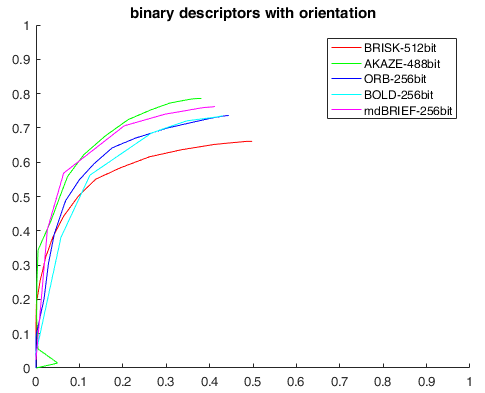
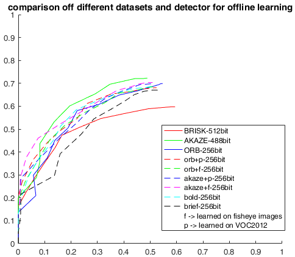
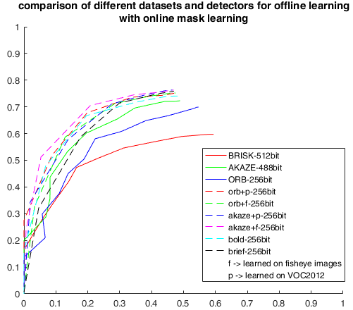

# mdBRIEF
**Author**: [Steffen Urban](http://www.ipf.kit.edu/english/staff_urban_steffen.php) (urbste at googlemail.com)
This repository contains a method to distort binary descriptors using calibrated cameras.
In addition, masks can be learned online.

## News
- [Paper](https://arxiv.org/abs/1610.07804)
- 28/10/2016 first commit

This repository contains the following methods:
- dBrief and mdBrief a distorted and masked version of binary descriptors
- [BOLD](https://github.com/vbalnt/bold)
- Offline ORB-like training code for uncorrelated binary test sets
- Evaluation Code for the sRD-SIFT dataset

# 1. Related Publication:
    @Article{UrbanMultiColSLAM16,
      Title={{mdBrief} - A Fast Online Adaptable, Distorted Binary Descriptor for Real-Time Applications Using Calibrated Wide-Angle Or Fisheye Cameras},
      Author={Urban, Steffen and Hinz, Stefan},
      Journal={arXiv preprint arXiv:1610.07804},
      Year={2016}}
    
# 2. Requirements
Most of this Code is written in Matlab and C++. To access feature detectors and descriptors and
to speed up the matching and offline learning, we use mexopencv as a bridge between C++ and Matlab.

- Matlab
- OpenCV 3.1
- C++ Compiler
- mexopencv [link](https://github.com/kyamagu/mexopencv)

# 3. Installation instructions

- First install/compile mexopencv by following the installation instructions on [link](https://github.com/kyamagu/mexopencv)
- Once you have compiled mexopencv, copy the .cpp and .h files from the mdBrief/ to mexopencv/src/+cv
- Then run the compilation script of mexopencv once again. This will compile mdBRIEF, BOLD and so on

# 4. Training a binary descriptor 
Here we are using the VOC2012 dataset as done for the ORB descriptor.
You can try this with every image dataset, or even train it on your set of images from a
specific application

- Download and extract [link](http://host.robots.ox.ac.uk/pascal/VOC/voc2012/VOCtrainval_11-May-2012.tar)
- Adjust the path in ExtractKeypointsAndPatches.m to point to the VOCdevkit/VOC2012/JPEGImages/img folder
- Run the script ExtractKeypointsAndPatches.m
- This will create 3 .mat files 

# 5. Running the evaluation scripts

- Download sRD-SIFT dataset: [Download](http://arthronav.isr.uc.pt/~mlourenco/srdsift/dataset.html)
- Extract archive.
- Open evaluateFireWire.m and set the paths to the dataset and the ground truth homographies
- Run the script. To avoid to long runtimes and to test the descriptor, you can set the variable maxComb which regulates the number of image pairs. Maximum is 78.

### Here are some PR curves for the FireWire dataset using 20 image pairs:

Rotating the patches:

Without rotation (the datasets contains almost not rotation about the view axis:

### Evaluating offline learned test sets (learned using different detectors and datasets)

